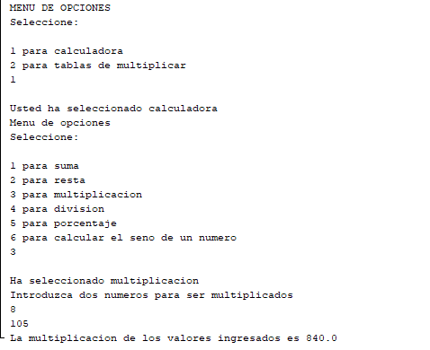
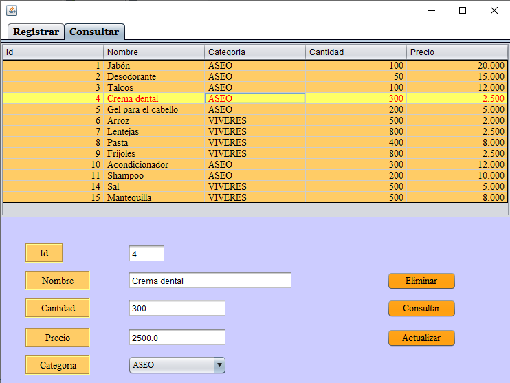
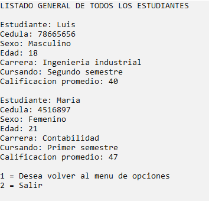
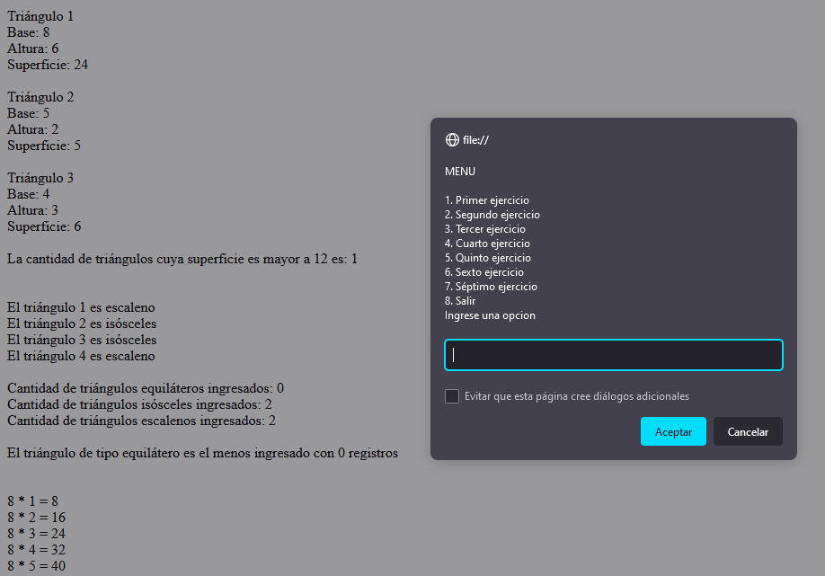
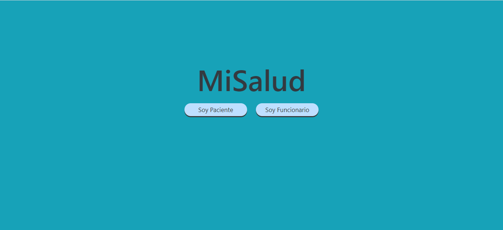
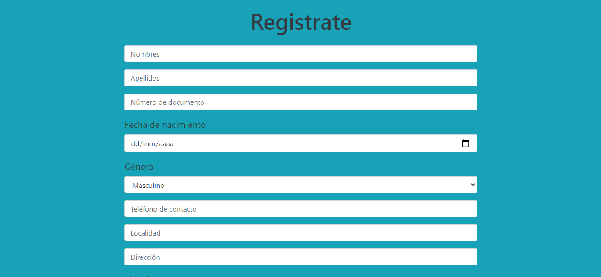
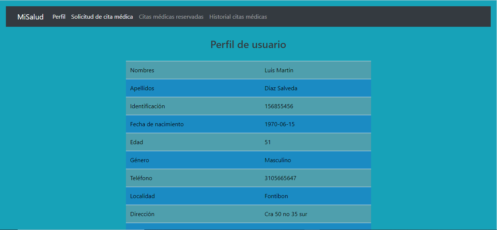
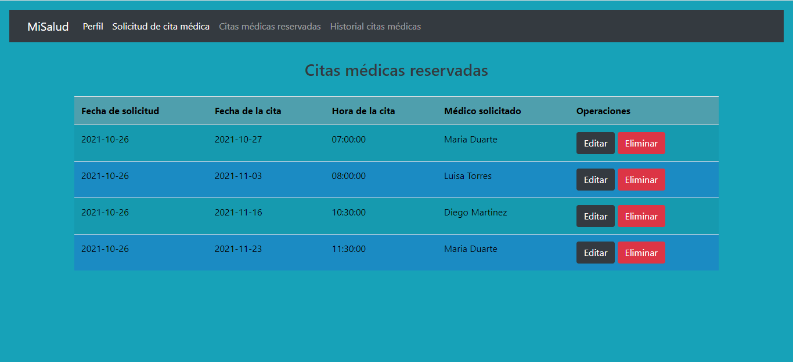
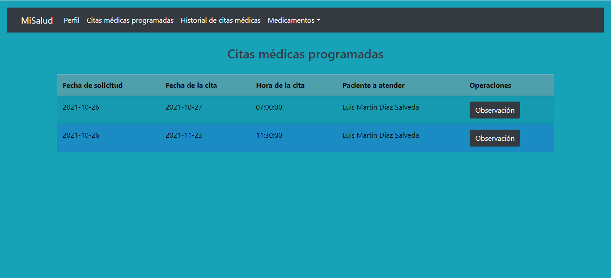

# Proyectos realizados

------------
### 1. Calculadora y tablas de multiplicar en Java
Programa realizado en consola haciendo uso de las funciones básicas de un lenguaje de programación implementando el uso de menús y ciclos reiterativos.

------------
### 2. Control de ventas utilizando POO en Java
Programa realizado mediante el paradigma de programación orientada a objetos, el cuál hace uso de la relación de clases para crear objetos que almacenan información de las ventas realizadas por una empresa hipotética. En el programa se pueden almacenar hasta 10 empleados y 20 ventas (valores modificables en la clase Empresa), este programa se corre en consola y desde la clase Principal.

------------
### 3. Interfaz gráfica calculadora básica en Java
El proyecto es una calculadora básica en Java utilizando los componentes gráficos de la bibleoteca Swing.

------------
### 4. Interfaz gráfica cálculo de nota final en Java
El proyecto es una interfaz gráfica de tres ventanas, el cual permite calcular la nota final de una materia elegida por el usuario, la primer ventana muestra una barra de herramientas donde esta un menú con las materias, la segunda ventana muestra información de la materia elegida y permite calcular la nota final introduciendo tres notas y por último la tercer ventana muestra el proceso del estudiante dependiendo si aprobó o no aprobó la materia.

------------
### 5. Modelo vista controlador y conexión a base de datos en Java
El programa es una interfaz gráfica diseñada para un almacén o tienda que necesite llevar el control del inventario de sus productos. El proyecto se desarrolló utilizando el modelo vista controlador para su estructura y se implementó el modelo CRUD utilizando el gestor de base de datos SQLite para almacenar información y así permitir el registro, consulta, actualización y elminación de registros.

------------
### 6. Calculadora de matrices con C++
Programa desarrollado en consola, el cual permite desarrollar operaciones básicas con matrices algebraicas, el programa muestra un menú desarrolado mediante ciclos para que el usuario elija la operación que desee hacer, la operación de dividir matrices se encuentra hipotéticamente como complemento, ya que esta operación no esta definida en las matrices.

------------
### 7. Control de alumnos y materias en C++
Programa desarrollado en consola, el cual permite ingresar un número de alumnos y las materias que va a cursar en un determinado semestre, la información la ingresa el usuario y posteriormente la puede consultar de diferentes maneras en un menú que se despliega.

------------
### 8. HTML5 primeros pasos
Desarrollo de una página web con información de las fuerzas militares de Colombia y los procesos de inscripción a las mismas, el desarrollo utiliza las principales etiquetas de HTML5 y se agrega estilos básicos con CSS.

------------
### 9. Tienda virtual de electrodomésticos con HTML5 y CSS
Desarrollo de una página web de una tienda de electrodomésticos en la cual se muestra diferentes productos con sus correspondientes imágenes y sus características. La página esta contruida totalmente con HTML5 y CSS, además cuenta con unas sencillas funcionalidades desarrollada con JavaScript. La página no tiene funcionalidad dinámica, ya que el objetivo de su desarrollo era el uso de HTML5 y CSS.

------------
### 10. JavaScript primeros pasos
Programas sencillos utilizando la sintaxis básica de JavaScript, variables, ciclos y condicionales.

------------
### 11. Simulador de crédito con PHP y HTML5
Desarrollo de una página web con PHP, HTML5 y la herramienta XAMPP que actúa como servidor para que la página funcione. El programa simula el valor a pagar por solicitar un préstamo, este calcula el crédito solicitado con cuota fija o cuota variable dependiendo de la elección del usuario y utiliza las formulas de contabilidad establecidas. Los valores como la tasa anual están prestablecidos, en caso de que se quiera utilizar otro valor se debe cambiar.

------------
### 12. Consultorio médico online con Python y Flask
Desarrollo de una página web con Python y la librería Flask, este se desarrollo en un entorno virtual en el que se desacargaron las dependecias. El programa es un consultorio online que permite que los usuarios de una EPS se puedan registrar y solicitar citas médicas de medicina general, estas citas además se pueden gestionar por medio del modelo CRUD, se puede visualizar la información, actualizar y eliminar. Para almacenar dicha información se realizó una conexión a una base de datos en PostgreSQL por medio del ORM SQLAlchemy.

------------
### 13. Conexión a base de datos con PHP y uso de Bootstrap
Desarrollo de una página web con PHP, HTML, CSS y uso de Bootstrap para complemnetar los estilos, la página es un CRUD básico en el que se puede registrar, actualizar, eliminar y consultar individualmente o grupalmente los datos de una base de datos de usuarios, se utiliza XAMPP como herramienta para emular el servidor y MySQL Workbench como gestor de base de datos para realizar la conexión y mantener la persistencia de los datos.

